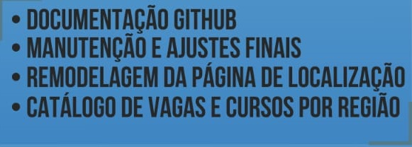
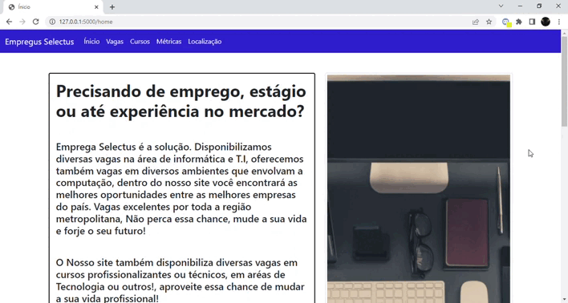

# API: 1º ADS - Little Tech

Aprendizado por Projeto Integrado do 1º semestre da Faculdade de Tecnologia de São José dos Campos - "Professor Jessen Vidal".

<h2> O Projeto 💼 </h2>
Desenvolver um sistema web para automatizar o processo de catalogar vagas de diversas profissões principalmente  TI  e  configurar  métricas  para  pontos  como  tipos  de  conhecimento,  habilidades  e competências.  Visualmente  deverá  ter  informações  do  tipo  estratégicas,  facilidades  de usabilidade  e operação bem como toda a documentação de desenvolvimento no GitHub com todos os processos necessários para a fidelização do cliente. 

<h2>Objetivos 📌</h2>
Temos como objetivo desenvolver uma website com o foco na classificação de vagas de emprego e cursos tendo como prioridade vagas e cursos na área de T.I., visando facilitar a procura de possíveis usuários pelas oportunidades certas. 
 
 
<h3> Requisitos Funcionais: </h3>
 
 
O sistema web deverá ter no mínimo 5 páginas com as seguintes funções:
 
 
 • Página principal do projeto.  
 • Disponibilizar Vagas de Emprego.  
 • Ofertar Cursos e Certificações.  
 • Informações Métricas de vagas e cursos com base em: conhecimentos necessários, habilidades e requisitos.  
 • Busca de vagas e cursos por sua localização.  
 
 
<h3> Requisitos Não Funcionais: </h3> 
 
 
 • Linguagem Python 
 • Linguagem HTML e CSS 
 • Uso do framework Bootstrap 
 • Apresentação via Github 
 • Site de caráter institucional 
 • Github 
 
 
<h2>Cronograma da 3ª Sprint 📆</h2>
 

<h3> • Sprint 3 - 16/54 a 05/06 </h3>

✔️ Documentação final via Github  
✔️ Ajustes no site  
✔️ Remodelagem da página de localização  
✔️ Catálogo de vagas por região  

 
 
<h2>Visual do Site 💻</h2> 
<h3>Página de Ínicio.</h3>  

   

  
<h3>Página de Vagas com barra de busca e vagas catalogadas automaticamente.</h3>  

   

  
<h3>Página de Cursos com barra de busca e cursos catalogados automaticamente.</h3>  

   

  
<h3>Página de Métricas.</h3>  

   

  
<h3>Página de Localização com o local das empresas e filtro de busca por cidade.</h3>  

   

 
 
<h2>Tecnologias Utilizadas 🔧</h2>
 
• Back-end: Python, Flask, API: Maps JavaScript API, Javascript, Bibliotecas Python: Beautiful Soup, requests. 
• Front-end: HTML, CSS, Bootstrap, Javascript, API: Maps JavaScript API. 
• Ferramentas: Github, Visual Studio Code, Discord. 
 
 

 
  
 
     
                      
     
 
 
  
 
 
 
 
 
 
 
<h2>Backlog 📊</h2> 
 O product backlog é uma lista ordenada que tem como função documentar de forma clara todos os requisitos do desenvolvimento de um projeto. Itens que precisem de maior refinamento geralmente têm uma importância menor e ficam mais abaixo no Product Backlog.  
 
 

 
 
<h2>Burndown 📈📉 </h2>  
 O Sprint Burndown Chart mostra a comparação entre o trabalho estimado inicialmente no Sprint Planning Meeting com a quantidade restante estimada de trabalho.
 
<h3>Burndown - Sprint 3 </h3>  
  
 
 
<h2>Equipe 👾</h2>
 
 Nome|Função|Github|Linkedin 
-----|------|------|---------
Brener Reis    |Desenvolvedor|[@Github](https://github.com/BrenerReis)|[@Linkedin](https://www.linkedin.com/in/brener-freire-058950230/)
Gabriel Angelis|Desenvolvedor|[@Github](https://github.com/GabrAngelis)|[@Linkedin](https://www.linkedin.com/in/gabriel-luis-de-angelis-b64816237/)
Isabel Reis    |Product Owner|[@Github](https://github.com/VitoriaKings)|[@Linkedin](https://www.linkedin.com/in/isabel-reis-09806920b/)
Mariana Veloso |Scrum Master |[@Github](https://github.com/Marih2210)|[@Linkedin](https://www.linkedin.com/in/mariana-veloso-979436231)
Nicolas Pereira|Desenvolvedor|[@Github](https://github.com/NicolasPereira06)|[@Linkedin](https://www.linkedin.com/in/nicolas-bonif%C3%A1cio-426804237/)
Rafaela Cabral |Desenvolvedor|[@Github](https://github.com/RafaelaCabral)|[@Linkedin](https://www.linkedin.com/in/rafaela-vieira-cabral-733b5922a)
Thyago Silveira|Desenvolvedor|[@Github](https://github.com/Thyaguixx)|[@Linkedin](https://www.linkedin.com/in/thyago-silveira-276984237/)

 
 
 

